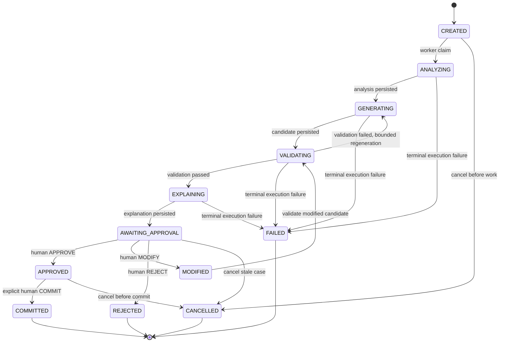

# Decision Case — state-machine transition table

Status: DESIGN DRAFT, 2026-09-21. State names follow Operations and Multi-Agent Contract v3.0; edge guards and retry semantics are proposed backend behavior. This is separate from MaintenanceDecisionStatus.

Related: [persistence/transaction design](prisma-design-note.md), [API commands](api-endpoint-spec.md).

## Transition table

Every accepted transition performs a compare-and-swap on case status/revision, increments revision, and appends an ordered event in the same transaction. Background writes additionally require the current run/lease fence. Human transitions require authenticated factory access and the concurrency checks in the design note.

| From | To | Trigger / responsible actor | Guards | Atomic persisted output |
| --- | --- | --- | --- | --- |
| No case | CREATED | POST /decision-cases; OPERATOR/ENGINEER/ADMIN | Authorized factory, valid input contract, current snapshot/plan pair, idempotency reservation | Immutable input and basis references; case revision 1; CASE_CREATED event sequence 1; command receipt |
| CREATED | ANALYZING | Orchestration worker claims case | Expected revision/status; no live competing lease; inputs pinned | Stage run identity/lease; ANALYSIS_STARTED event |
| ANALYZING | GENERATING | Worker completes analysis | Valid analysis artifact against case basis; current lease | Immutable analysis trace/evidence; ANALYSIS_COMPLETED event |
| GENERATING | VALIDATING | Worker generates candidate | Candidate schema valid; same factory/basis; next candidate revision unique | Immutable Schedule + hash; selected schedule pointer; CANDIDATE_GENERATED event |
| VALIDATING | EXPLAINING | Validator succeeds | Validation explicitly PASSED; artifact references exact candidate hash/revision and snapshot | Immutable validation evidence; VALIDATION_PASSED event |
| VALIDATING | GENERATING | Validator fails generated candidate | Failure is repairable; generated candidate; bounded retry budget remains | Failed validation trace; VALIDATION_FAILED event; new attempt for generation; preserve old candidate |
| EXPLAINING | AWAITING_APPROVAL | Explanation completes | Explanation references exact validated candidate; validation still matches | Explanation artifact; REVIEW_READY event |
| AWAITING_APPROVAL | APPROVED | Human APPROVE | Current head pair equals case basis and expected pair; expected case/candidate revisions; passed validation and matching explanation | HumanDecision(APPROVE), evidence, status, audit/event and receipt; no schedule publication |
| AWAITING_APPROVAL | MODIFIED | Human MODIFY | Same concurrency guards; nonblank reason; replacement schedule schema-valid, same scope/resources and materially different from reviewed candidate | New immutable candidate revision; HumanDecision(MODIFY); old validation no longer applies; MODIFICATION_RECORDED event + receipt |
| MODIFIED | VALIDATING | Worker claims edited candidate | Exact modified candidate; lease/revision valid | New validation run; MODIFIED_VALIDATION_STARTED event |
| APPROVED | COMMITTED | Human COMMIT | Fresh expected head pair AND original case basis; expected case/candidate revision; recorded approval covers exact candidate; one commit per case | ScheduleCommit; current schedule pointer/version; HumanDecision(COMMIT); COMMITTED event/audit/receipt in one transaction |
| AWAITING_APPROVAL | REJECTED | Human REJECT | Expected head/case/candidate revisions match; authorized reviewer | HumanDecision(REJECT), status, reason if supplied, REJECTED event/audit/receipt; no plan change |
| ANALYZING/GENERATING/VALIDATING/EXPLAINING | FAILED | Worker or system marks unrecoverable execution failure | Current case revision, safe error code/message, no pending successful transition to persist | FAILED event, sanitized error evidence, audit/receipt if human-triggered |
| CREATED/AWAITING_APPROVAL/APPROVED | CANCELLED | Human/system cancellation | Current case revision, no commit published; role/policy permits cancellation | CANCELLED event, reason if supplied, audit/receipt if human-triggered |

## Meaning of the outcome states

- APPROVED is a recorded authorization for one immutable candidate; it is not terminal because COMMIT can follow. The published plan remains unchanged until commit.
- MODIFIED is a recorded human edit awaiting validation, not permission to publish. The edited candidate flows through VALIDATING → EXPLAINING → AWAITING_APPROVAL and requires a fresh APPROVE. The human MODIFY event is retained through later state changes.
- REJECTED, COMMITTED, FAILED and CANCELLED are terminal. COMMITTED means the platform published a schedule, not that physical operations completed. FAILED/CANCELLED are canonical v3 lifecycle states and should not be modeled only as processing flags.
- The supplied slash notation `APPROVED/MODIFIED/REJECTED/COMMITTED` is interpreted as available outcome states, not permission for a direct AWAITING_APPROVAL → COMMITTED edge. If the canonical contract requires modify-and-commit or approve-and-commit, agree a new atomic command explicitly; do not implement it by skipping review guards.

## Failures, retries and stale evidence

FAILED and CANCELLED are canonical case statuses. Proposed v1 may still expose `processing.status = QUEUED | RUNNING | BLOCKED | IDLE`, attempt and sanitized last_error independently for non-terminal stage progress.

| Situation | Behavior |
| --- | --- |
| Transient agent/tool failure | Stay in current state; append STAGE_FAILED event and trace; retry same stage with new run attempt/lease, bounded by configured budget. Do not duplicate candidate revisions or successful events. |
| Validation failure of human-modified candidate | Stay VALIDATING and set processing BLOCKED with validation errors. Do not silently regenerate/replace a human edit. With no repair endpoint in v1, user creates a new case; a future correction command is a contract extension. |
| Unrepairable failure or exhausted budget | Transition an executing case to FAILED, retaining sanitized error evidence and events; no automatic approval. New case is the v1 recovery path. Retry attempts before budget exhaustion are trace events, not backwards lifecycle transitions. |
| Snapshot or current published plan changed | Case remains on its immutable basis. Mark computed `stale=true` in reads; review/commit returns 409. Create a new case from a fresh snapshot/plan pair. No in-place rebase. |
| Worker lease expired | New owner gets new lease token/attempt; previous owner cannot persist. Same-state recovery is an event + CAS revision, not a duplicate transition. |
| Concurrent human commands | One case revision CAS wins; losing command rolls back its writes and gets 409. Identical idempotency replay returns original success. |
| Commit after successful approval but changed head | 409, keep APPROVED and existing approval history. Do not publish, auto-reapprove or rewrite expected versions. |
| Authorization failure | 401/403, or 404 for inaccessible IDs; no case/history mutation. |

All edges absent from the table are forbidden with 409 INVALID_CASE_TRANSITION. In particular: CREATED → APPROVED, AWAITING_APPROVAL → COMMITTED, MODIFIED → COMMITTED, APPROVED → MODIFIED, REJECTED → CREATED and COMMITTED → any other state. Human requests cannot set status directly; the server maps commands to transitions.

## Review checklist / eventual transition tests

Parameterize every from/to state pair: allow only table edges and assert exact guards/effects. Cover a complete happy path, modify/revalidate/reapprove/commit, failed modified validation, rejection, transient retry, stale worker writes, competing reviewers, competing commits across cases, approval with stale snapshot, commit with stale plan, changed candidate after validation, idempotent replay after head changes, and terminal-history mutation attempts. These are implementation acceptance scenarios, not tests claimed to have run for this design-only deliverable.
