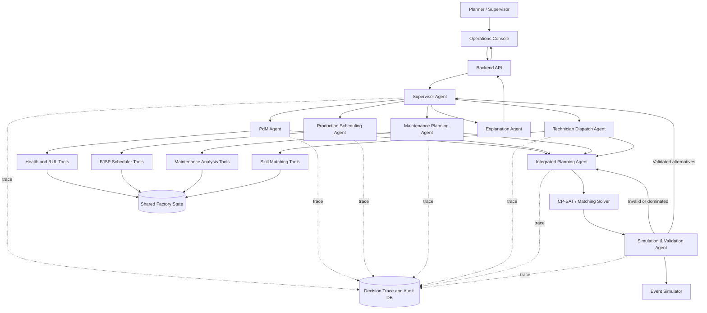
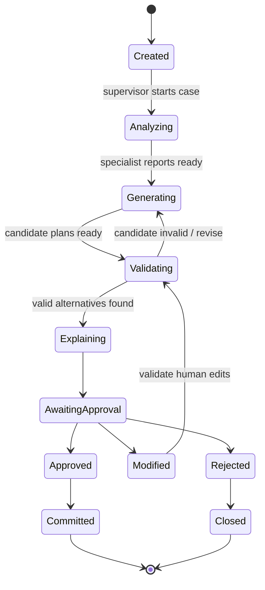
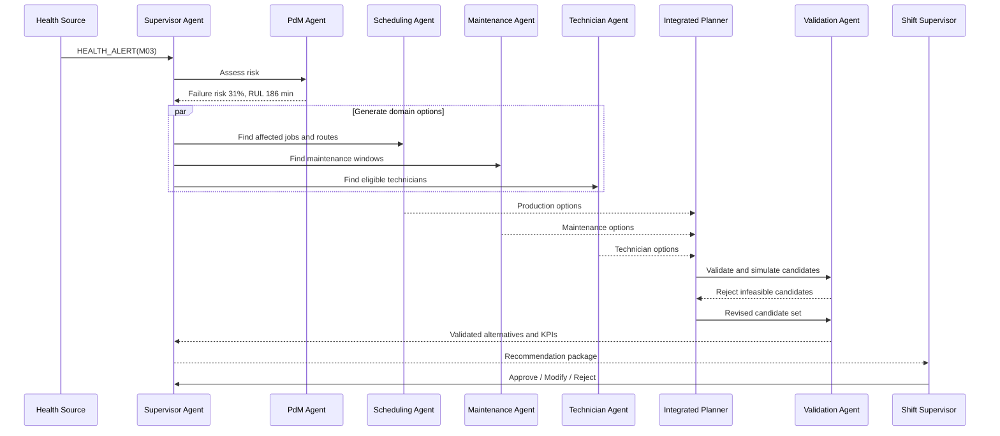
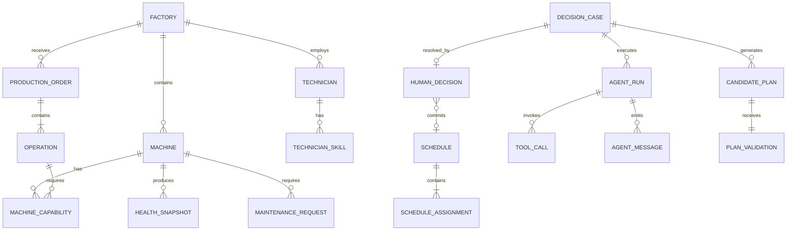

# Đặc tả sản phẩm: Multi-Agent Decision Support Platform for Predictive Maintenance and Production Scheduling

> **Tên làm việc:** MA-PdM Planner
>
> **Tên tiếng Việt:** Nền tảng đa tác tử hỗ trợ điều độ sản xuất và bảo trì dự đoán
>
> **Phiên bản tài liệu:** 0.1
>
> **Trạng thái:** Product concept và MVP specification
>
> **Đối tượng sử dụng tài liệu:** nhóm phát triển, giảng viên hướng dẫn, hội đồng đồ án và người đánh giá kỹ thuật

---

## 1. Tóm tắt sản phẩm

MA-PdM Planner là một nền tảng hỗ trợ ra quyết định cho xưởng sản xuất CNC. Hệ
thống phối hợp ba nhóm quyết định vốn thường được xử lý riêng biệt:

1. điều độ job và operation trên các máy có khả năng thay thế nhau;
2. lựa chọn thời điểm bảo trì dựa trên tình trạng và rủi ro hỏng của máy;
3. phân công kỹ thuật viên dựa trên kỹ năng, thời gian sẵn sàng và thời lượng
   can thiệp.

Sản phẩm sử dụng kiến trúc multi-agent theo mô hình supervisor–specialist. Mỗi
AI agent có mục tiêu, dữ liệu đầu vào, bộ công cụ và phạm vi quyền hạn riêng.
Các agent không trực tiếp thay đổi lịch vận hành. Chúng tạo và đánh giá các
phương án; bộ solver xác định tính khả thi; người vận hành phê duyệt quyết định
cuối cùng.

Sản phẩm không nhằm thay thế ERP, MES hoặc CMMS. Trong phạm vi đồ án, sản phẩm
đóng vai trò một lớp decision-support nằm giữa dữ liệu vận hành và người lập kế
hoạch.

### 1.1. Phát biểu sản phẩm trong một câu

> Khi tình trạng máy, lịch sản xuất hoặc nguồn lực bảo trì thay đổi, hệ thống sử
> dụng nhiều agent chuyên môn để tạo, kiểm tra, giải thích và trực quan hóa các
> phương án điều độ tích hợp, giúp planner lựa chọn phương án cân bằng giữa tiến
> độ, độ tin cậy, chi phí và nguồn lực kỹ thuật viên.

### 1.2. Giá trị mang lại

- Kết hợp production scheduling và maintenance planning trên cùng một timeline.
- Biến dự báo RUL/failure risk thành hành động vận hành có thể thực hiện.
- Phát hiện trước xung đột giữa máy, job, maintenance window và kỹ thuật viên.
- So sánh tác động của nhiều phương án trước khi áp dụng.
- Giải thích agent nào đã làm gì, gọi tool nào và dựa trên bằng chứng nào.
- Duy trì human-in-the-loop, audit trail và khả năng tái hiện quyết định.

---

## 2. Bối cảnh và vấn đề cần giải quyết

Trong một xưởng CNC, production planner thường tối ưu tiến độ đơn hàng trong khi
maintenance planner tập trung vào độ tin cậy của máy. Nếu hai kế hoạch được tạo
riêng biệt, một số tình huống có thể xuất hiện:

- job quan trọng được route vào máy đang có nguy cơ hỏng cao;
- maintenance được lên lịch tại thời điểm gây ảnh hưởng lớn đến due date;
- kỹ thuật viên có chứng chỉ phù hợp không sẵn sàng khi maintenance bắt đầu;
- quyết định trì hoãn bảo trì không xét đến tải sản xuất sắp tới;
- một lịch sản xuất khả thi về máy nhưng không khả thi về nhân lực bảo trì;
- planner không biết vì sao hệ thống khuyến nghị một hành động cụ thể.

Các mô hình predictive maintenance truyền thống thường chỉ trả về health score,
RUL hoặc cảnh báo. Chúng không trả lời câu hỏi vận hành tiếp theo: nên dừng máy
khi nào, chuyển job đi đâu, ai thực hiện bảo trì và tác động đến kế hoạch giao
hàng là gì.

MA-PdM Planner giải quyết khoảng trống đó bằng một quy trình quyết định khép kín:

```text
Dữ liệu vận hành
  → Phát hiện sự kiện
  → Phân tích đa tác tử
  → Sinh các phương án
  → Kiểm tra ràng buộc
  → Mô phỏng tác động
  → Giải thích
  → Con người phê duyệt
  → Cập nhật kế hoạch và lưu audit
```

---

## 3. Mục tiêu và phạm vi

### 3.1. Mục tiêu sản phẩm

MVP phải chứng minh được các khả năng sau:

1. Quản lý một factory scenario gồm máy, job, operation, kỹ thuật viên và tình
   trạng máy.
2. Sinh một lịch sản xuất khả thi theo precedence và machine eligibility.
3. Sinh cảnh báo bảo trì từ health/RUL hoặc failure probability.
4. Tạo nhiều phương án phối hợp production–maintenance–technician.
5. Loại bỏ phương án vi phạm hard constraints.
6. So sánh phương án theo các KPI vận hành.
7. Hiển thị rõ luồng thực thi agent, message và tool call.
8. Cho phép người dùng approve, modify hoặc reject recommendation.
9. Lưu đầy đủ decision trace để audit và replay.

### 3.2. Phạm vi MVP

- Một factory/site.
- 5–10 máy.
- 10–30 job trong một planning horizon.
- Mỗi job gồm một chuỗi operation có precedence.
- Một operation có thể chạy trên một hoặc nhiều máy hợp lệ.
- 3–5 kỹ thuật viên.
- Hai loại maintenance: preventive và corrective.
- Một kỹ thuật viên cho mỗi maintenance task.
- Technician eligibility, availability và intervention duration.
- Health score, RUL distribution hoặc failure probability cho mỗi máy.
- Static job set khi bắt đầu ca; sự kiện health/failure có thể xuất hiện trong
  lúc mô phỏng.
- Heuristic hoặc CP-SAT làm scheduling engine chính.
- Multi-agent orchestration tạo và đánh giá recommendation.
- Human approval trước khi commit kế hoạch.

### 3.3. Ngoài phạm vi MVP

- Điều khiển trực tiếp PLC hoặc CNC controller.
- Tự động phát work order sang CMMS thật.
- Multi-site hoặc multi-factory.
- Spare-parts optimization chi tiết.
- Multi-technician collaborative maintenance.
- Technician travel network, fatigue hoặc learning curve.
- Dynamic job arrival liên tục ở quy mô lớn.
- Digital twin được xác nhận cho một nhà máy cụ thể.
- Cam kết an toàn chức năng hoặc thay thế quyết định của kỹ sư.
- Bắt buộc sử dụng reinforcement learning để hệ thống hoạt động.

---

## 4. Người dùng và vai trò

### 4.1. Production Planner

Mục tiêu:

- hoàn thành đơn hàng đúng hạn;
- giảm makespan và tardiness;
- phản ứng nhanh khi máy không còn khả dụng.

Chức năng chính:

- xem Gantt chart;
- nhập hoặc import job;
- xem operation bị ảnh hưởng;
- so sánh lịch hiện tại với lịch đề xuất;
- chỉnh sửa routing hoặc priority;
- phê duyệt rescheduling.

### 4.2. Maintenance Planner

Mục tiêu:

- giảm failure và emergency downtime;
- chọn maintenance window phù hợp;
- sử dụng kỹ thuật viên hiệu quả.

Chức năng chính:

- theo dõi health/RUL;
- tạo hoặc duyệt maintenance request;
- xem tác động của việc trì hoãn;
- xem technician eligibility;
- lựa chọn preventive hoặc corrective action.

### 4.3. Shift Supervisor

Mục tiêu:

- cân bằng production và maintenance trong ca;
- giải quyết xung đột nguồn lực;
- chịu trách nhiệm cho quyết định cuối.

Chức năng chính:

- nhận recommendation;
- xem lý do và bằng chứng;
- approve, modify hoặc reject;
- thêm ghi chú quyết định;
- theo dõi execution status.

### 4.4. Plant Manager hoặc Viewer

Mục tiêu:

- theo dõi KPI;
- đánh giá hiệu quả của decision-support;
- xem báo cáo lịch sử.

Chức năng chính:

- xem dashboard tổng hợp;
- so sánh baseline và integrated plan;
- xem tỷ lệ recommendation được chấp nhận;
- xem downtime, failure, tardiness và chi phí.

### 4.5. Administrator/Engineer

Mục tiêu:

- cấu hình factory, policy và agent;
- quản lý tài khoản và quyền hạn;
- kiểm tra audit log.

---

## 5. Các khái niệm cốt lõi

### 5.1. Agent

Agent là một thành phần có:

- mục tiêu cụ thể;
- context và state;
- khả năng lựa chọn tool;
- output schema bắt buộc;
- phạm vi quyền hạn;
- điều kiện thành công/thất bại;
- khả năng nhận feedback và tạo phương án mới.

Agent không đồng nghĩa với microservice. Một microservice có thể chứa nhiều
agent, và một agent có thể gọi nhiều service/tool.

### 5.2. Tool

Tool là một hàm hoặc service có input/output xác định. Tool không tự đặt mục
tiêu và không tự quyết định bước tiếp theo.

Ví dụ:

- đọc sensor window;
- dự đoán RUL;
- chạy CP-SAT;
- tìm technician hợp lệ;
- tính tardiness;
- mô phỏng một candidate plan;
- kiểm tra hard constraints.

### 5.3. Decision Case

Decision Case là đơn vị công việc trung tâm của hệ thống. Một case được tạo khi
có sự kiện cần ra quyết định, ví dụ:

- machine health alert;
- machine failure;
- technician unavailable;
- maintenance request mới;
- người dùng yêu cầu tạo lại schedule;
- người dùng chạy what-if scenario.

Decision Case chứa toàn bộ:

- triggering event;
- factory-state snapshot;
- agent runs;
- tool calls;
- messages;
- candidate plans;
- validation results;
- recommendation;
- human decision;
- committed plan revision.

### 5.4. Candidate Plan

Candidate Plan là một phương án đầy đủ hoặc một patch áp dụng lên lịch hiện tại,
bao gồm:

- operation–machine assignments;
- start/end time;
- maintenance windows;
- technician assignments;
- predicted KPIs;
- assumptions;
- constraint-validation status.

### 5.5. Hard constraint và soft objective

Hard constraints không được phép vi phạm:

- operation precedence;
- một máy không xử lý hai task cùng lúc;
- một technician không thực hiện hai task cùng lúc;
- machine eligibility;
- technician certification/skill eligibility;
- machine phải dừng trong maintenance window;
- corrective safety rules được cấu hình.

Soft objectives dùng để xếp hạng phương án:

- makespan;
- total hoặc maximum tardiness;
- failure probability;
- expected downtime;
- maintenance cost;
- technician waiting/overtime;
- schedule instability;
- computation latency.

---

## 6. Kiến trúc multi-agent

### 6.1. Tổng quan



### 6.2. Nguyên tắc orchestration

- Supervisor là điểm vào duy nhất cho một Decision Case.
- Specialist agent có quyền đọc snapshot nhưng chỉ ghi vào output namespace của
  chính nó.
- Agent trao đổi thông qua structured message, không phụ thuộc vào chat tự do.
- Solver quyết định feasibility; LLM không được tự tuyên bố một lịch là khả thi.
- Validation Agent phải kiểm tra mọi candidate trước khi hiển thị cho người dùng.
- Mọi tool call có correlation ID và được lưu trong decision trace.
- Kế hoạch chỉ được commit sau human approval, trừ chế độ mô phỏng.
- Một agent failure không được làm mất lịch hiện tại.

### 6.3. Shared state

Ví dụ state tối thiểu:

```json
{
  "decision_case_id": "dc-2026-0017",
  "status": "VALIDATING",
  "trigger": {
    "type": "HEALTH_ALERT",
    "machine_id": "M03",
    "occurred_at": "2026-09-20T14:02:01+08:00"
  },
  "factory_snapshot_id": "snapshot-1420",
  "machine_risk_reports": [],
  "affected_operations": [],
  "production_options": [],
  "maintenance_options": [],
  "technician_options": [],
  "candidate_plans": [],
  "validation_results": [],
  "recommendation": null,
  "human_decision": null
}
```

### 6.4. Agent state machine



---

## 7. Đặc tả từng agent

## 7.1. Supervisor Agent

### Mục tiêu

Điều phối toàn bộ Decision Case, xác định agent cần tham gia, tổng hợp kết quả và
đưa case đến trạng thái chờ phê duyệt.

### Input

- triggering event;
- factory snapshot;
- user request;
- orchestration policy;
- time/compute budget.

### Tools

- `read_factory_snapshot`
- `create_agent_task`
- `read_agent_result`
- `compare_candidate_plans`
- `request_plan_validation`
- `create_recommendation`
- `close_decision_case`

### Output

- task graph;
- case status;
- final recommendation package;
- escalation hoặc failure report.

### Quyền hạn

- Được tạo task cho agent khác.
- Không được tự commit schedule.
- Không được bỏ qua Validation Agent.
- Không được thay đổi health prediction hoặc solver result.

### Điều kiện hoàn thành

- có ít nhất một candidate plan hợp lệ; hoặc
- kết luận có cấu trúc rằng không tìm thấy phương án khả thi;
- toàn bộ trace đã được lưu.

## 7.2. PdM Agent

### Mục tiêu

Chuyển dữ liệu condition monitoring thành báo cáo rủi ro có thể dùng cho quyết
định scheduling và maintenance.

### Input

- machine ID;
- sensor/health observations;
- current operating load;
- planned operations;
- health-model version;
- prediction horizon.

### Tools

- `get_machine_health_history`
- `get_sensor_window`
- `predict_rul_distribution`
- `estimate_failure_probability`
- `estimate_operation_damage`
- `compare_health_scenarios`

### Output

```json
{
  "machine_id": "M03",
  "prediction_horizon_minutes": 240,
  "expected_rul_minutes": 186,
  "failure_probability": 0.31,
  "confidence": "MEDIUM",
  "risk_level": "HIGH",
  "risk_drivers": [
    "high-load operation O17",
    "increasing wear trend"
  ],
  "recommended_review_window_minutes": 90
}
```

### Quyền hạn

- Chỉ cung cấp risk assessment.
- Không trực tiếp yêu cầu dừng máy.
- Không được truy cập latent simulator state trong chế độ deployment/demo vận
  hành nếu state đó không quan sát được.

## 7.3. Production Scheduling Agent

### Mục tiêu

Xác định operation bị ảnh hưởng và tạo các routing/scheduling option có xét đến
deadline, machine capability và health risk.

### Input

- active jobs;
- operation precedence;
- machine capabilities;
- current schedule;
- machine risk reports;
- planning horizon.

### Tools

- `list_active_jobs`
- `get_operation_precedence`
- `get_machine_capabilities`
- `find_alternative_machines`
- `generate_dispatch_schedule`
- `generate_cp_sat_schedule`
- `calculate_production_kpis`

### Output

- affected jobs/operations;
- alternative routing options;
- schedule candidates;
- predicted makespan và tardiness;
- assumptions và unresolved conflicts.

### Quyền hạn

- Được tạo candidate schedule.
- Không được tự xác nhận technician availability.
- Không được commit schedule.

## 7.4. Maintenance Planning Agent

### Mục tiêu

Tạo các maintenance option cân bằng giữa failure risk, downtime, production
impact và maintenance cost.

### Input

- machine risk report;
- current/planned machine usage;
- maintenance-action catalog;
- maintenance policy;
- allowed delay và safety rules.

### Tools

- `list_maintenance_actions`
- `estimate_maintenance_duration`
- `estimate_restoration_effect`
- `find_maintenance_windows`
- `estimate_delay_risk`
- `compare_preventive_corrective_cost`

### Output

- maintain now;
- maintain in recommended window;
- continue and monitor;
- corrective action khi failure đã xảy ra;
- risk/cost cho từng option.

### Quyền hạn

- Không được trì hoãn một safety-mandatory corrective action.
- Không tự phân công technician.
- Không tự commit work order.

## 7.5. Technician Dispatch Agent

### Mục tiêu

Tìm technician assignment khả thi và đánh giá trade-off giữa availability,
skill, duration và restoration quality.

### Input

- maintenance options;
- technician roster;
- skill/certification matrix;
- technician calendar;
- expected intervention duration;
- restoration parameters.

### Tools

- `get_technician_roster`
- `get_skill_matrix`
- `check_technician_availability`
- `estimate_intervention_duration`
- `estimate_restoration_quality`
- `solve_technician_matching`

### Output

- feasible technician candidates;
- earliest start time;
- expected duration;
- skill match;
- rejected assignments và lý do.

### Quyền hạn

- Không được gán technician thiếu certification bắt buộc.
- Không được ghi đè lịch technician đã khóa.
- Không trực tiếp tạo production schedule.

## 7.6. Integrated Planning Agent

### Mục tiêu

Tổng hợp output từ các specialist agent thành một tập candidate plan tích hợp.

### Input

- production options;
- maintenance options;
- technician options;
- objective weights;
- hard constraints;
- current committed schedule.

### Tools

- `build_integrated_problem`
- `run_cp_sat`
- `run_bipartite_matching`
- `run_rolling_horizon_optimizer`
- `score_candidate_plan`
- `calculate_schedule_stability`

### Output

Tối đa ba phương án có ý nghĩa khác nhau:

1. production-priority;
2. balanced;
3. reliability-priority.

Các phương án không nên chỉ khác nhau bởi một thay đổi nhỏ trong objective
weight. Mỗi phương án phải trình bày được trade-off vận hành rõ ràng.

### Quyền hạn

- Chỉ sử dụng output có schema hợp lệ của specialist agent.
- Không được tự bỏ hard constraint.
- Không được tự đánh dấu plan là validated.

## 7.7. Simulation and Validation Agent

### Mục tiêu

Xác nhận candidate plan khả thi và ước lượng tác động của plan trong các kịch
bản vận hành.

### Input

- candidate plan;
- factory snapshot;
- event/noise seed;
- validation policy;
- simulation horizon.

### Tools

- `validate_precedence`
- `validate_machine_capacity`
- `validate_technician_conflicts`
- `validate_skill_eligibility`
- `validate_maintenance_windows`
- `simulate_candidate_plan`
- `calculate_kpis`
- `compare_against_baseline`

### Output

```json
{
  "candidate_plan_id": "plan-balanced-02",
  "feasible": true,
  "hard_constraint_violations": [],
  "kpis": {
    "makespan_minutes": 512,
    "total_tardiness_minutes": 24,
    "expected_downtime_minutes": 18,
    "failure_probability": 0.07,
    "maintenance_cost": 420
  },
  "simulation_runs": 100,
  "warnings": [
    "result is sensitive to M03 restoration effectiveness"
  ]
}
```

### Quyền hạn

- Có quyền reject candidate vi phạm hard constraint.
- Không được sửa candidate để làm nó hợp lệ.
- Không được chọn phương án cuối thay người dùng.

## 7.8. Explanation Agent

### Mục tiêu

Chuyển decision trace và validation result thành giải thích ngắn gọn, có bằng
chứng và phù hợp với vai trò người dùng.

### Input

- validated plans;
- baseline comparison;
- agent evidence;
- user role;
- explanation template.

### Tools

- `read_decision_trace`
- `get_plan_differences`
- `get_kpi_differences`
- `get_constraint_evidence`
- `render_recommendation_summary`

### Output

- recommended plan;
- lý do chính;
- tác động so với current plan;
- rủi ro còn lại;
- assumptions;
- alternative plans.

### Quyền hạn

- Không được tạo số liệu mới.
- Không được thay đổi verdict của Validation Agent.
- Mọi con số trong explanation phải truy ngược được về tool output.

---

## 8. Tool registry

Mỗi tool cần đăng ký ít nhất các trường:

```yaml
tool_id: predict_rul_distribution
version: 1.0.0
owner: pdm-service
description: Predict the discrete RUL distribution for one machine.
input_schema: RULPredictionRequest
output_schema: RULDistribution
timeout_ms: 5000
side_effect: false
allowed_agents:
  - pdm-agent
audit_level: FULL
```

### 8.1. Nhóm Health/PdM tools

| Tool | Chức năng | Side effect |
|---|---|---:|
| `get_machine_health_history` | Đọc lịch sử health | Không |
| `get_sensor_window` | Đọc cửa sổ sensor gần nhất | Không |
| `predict_rul_distribution` | Dự đoán phân phối RUL | Không |
| `estimate_failure_probability` | Tính xác suất failure trong horizon | Không |
| `estimate_operation_damage` | Ước lượng damage do operation | Không |

### 8.2. Nhóm Scheduling tools

| Tool | Chức năng | Side effect |
|---|---|---:|
| `find_alternative_machines` | Tìm máy thay thế hợp lệ | Không |
| `generate_dispatch_schedule` | Sinh lịch theo heuristic | Không |
| `generate_cp_sat_schedule` | Sinh lịch bằng CP-SAT | Không |
| `calculate_production_kpis` | Tính makespan/tardiness | Không |
| `calculate_schedule_stability` | Đo mức thay đổi so với lịch hiện tại | Không |

### 8.3. Nhóm Maintenance tools

| Tool | Chức năng | Side effect |
|---|---|---:|
| `find_maintenance_windows` | Tìm cửa sổ bảo trì | Không |
| `estimate_delay_risk` | Ước lượng rủi ro khi trì hoãn | Không |
| `estimate_restoration_effect` | Ước lượng health sau bảo trì | Không |
| `compare_preventive_corrective_cost` | So sánh chi phí | Không |

### 8.4. Nhóm Technician tools

| Tool | Chức năng | Side effect |
|---|---|---:|
| `get_skill_matrix` | Đọc skill/certification | Không |
| `check_technician_availability` | Kiểm tra lịch rảnh | Không |
| `solve_technician_matching` | Tìm assignment khả thi | Không |
| `estimate_intervention_duration` | Ước lượng thời lượng | Không |

### 8.5. Nhóm Validation/Simulation tools

| Tool | Chức năng | Side effect |
|---|---|---:|
| `validate_constraints` | Kiểm tra toàn bộ hard constraints | Không |
| `simulate_candidate_plan` | Chạy what-if simulation | Không |
| `calculate_kpis` | Tính KPI của plan | Không |
| `compare_against_baseline` | So sánh với current/production-first plan | Không |

### 8.6. Nhóm commit tools

Các tool có side effect phải tách khỏi nhóm phân tích:

| Tool | Chức năng | Điều kiện |
|---|---|---|
| `commit_schedule_revision` | Commit lịch đã duyệt | Human approval hợp lệ |
| `create_maintenance_work_order` | Tạo work order nội bộ | Human approval hợp lệ |
| `record_human_decision` | Lưu approve/modify/reject | Authenticated user |

Không specialist agent nào được gọi trực tiếp nhóm commit tools. Backend workflow
service chỉ gọi chúng sau khi xác minh user permission và approval token.

---

## 9. Quy trình nghiệp vụ chính

## 9.1. Health alert và rescheduling



### Acceptance flow

1. Event được nhận và deduplicate.
2. Factory snapshot được khóa cho case.
3. PdM Agent tạo risk report.
4. Các agent chuyên môn tạo option song song khi dependency cho phép.
5. Integrated Planning Agent tạo candidate plans.
6. Validation Agent loại candidate không khả thi.
7. Explanation được sinh chỉ từ validated data.
8. Người dùng phê duyệt hoặc sửa.
9. Nếu sửa, plan phải được validate lại.
10. Backend commit revision và lưu audit.

## 9.2. What-if analysis

Người dùng có thể tạo scenario mà không thay đổi lịch thật:

- trì hoãn maintenance 30/60/120 phút;
- technician cụ thể không khả dụng;
- tăng tải của một operation;
- thay đổi RUL/failure-risk assumption;
- thêm job khẩn cấp;
- khóa một máy ở trạng thái unavailable.

Kết quả what-if phải được đánh dấu `SIMULATION_ONLY`. Không tool commit nào được
phép chạy trong chế độ này.

## 9.3. Manual schedule modification

Người dùng kéo một operation hoặc maintenance block trên Gantt:

1. frontend gửi schedule patch;
2. backend tạo Decision Case loại `MANUAL_PLAN_VALIDATION`;
3. Validation Agent kiểm tra constraint;
4. nếu hợp lệ, hệ thống hiển thị KPI delta;
5. người dùng xác nhận commit;
6. nếu không hợp lệ, UI hiển thị conflict cụ thể.

---

## 10. Giao diện người dùng

## 10.1. Operations Overview

Mục tiêu: trả lời nhanh “xưởng đang ở trạng thái nào?”.

Thành phần:

- machine status grid;
- health/RUL indicator;
- job progress;
- active maintenance tasks;
- technician availability;
- active alerts;
- KPI trong ca;
- danh sách Decision Case cần xử lý.

Không nên hiển thị số lượng experiment/policy làm thông tin chính trên trang
vận hành.

## 10.2. Integrated Schedule

Gantt chart có ba lane group:

- production operations theo machine;
- maintenance task theo machine;
- technician assignment.

Mỗi block hiển thị:

- task ID;
- start/end;
- status;
- risk hoặc priority;
- dependency;
- plan revision.

Chức năng:

- xem current và proposed plan;
- highlight phần bị thay đổi;
- filter theo máy/job/technician;
- mở conflict detail;
- tạo manual patch;
- mở what-if case.

## 10.3. Recommendation Center

Mỗi Decision Case hiển thị:

- sự kiện kích hoạt;
- tóm tắt rủi ro;
- recommended plan;
- tối đa hai alternative plan;
- KPI comparison;
- assumptions và warnings;
- bằng chứng agent/tool;
- nút `Approve`, `Modify`, `Reject`;
- ô decision note.

Ví dụ explanation:

> Đề xuất chuyển operation O17 từ M03 sang M05 và bảo trì M03 lúc 14:20 bởi K02.
> So với lịch hiện tại, phương án làm total tardiness tăng 6 phút nhưng giảm xác
> suất failure trước cuối ca từ 31% xuống 7% và giảm expected downtime 54 phút.
> K02 được chọn thay K03 vì thời gian can thiệp ngắn hơn 23 phút; cả hai đều đáp
> ứng certification bắt buộc.

## 10.4. Agent Control Room

Mục tiêu: visualize agent nào đang làm gì và có tool gì.

### Agent graph

Mỗi node thể hiện:

- agent name;
- current status;
- current task;
- last tool call;
- duration;
- success/failure state.

Trạng thái chuẩn:

- `IDLE`
- `QUEUED`
- `RUNNING`
- `WAITING_FOR_DEPENDENCY`
- `COMPLETED`
- `FAILED`
- `CANCELLED`

### Tool-call timeline

Ví dụ:

```text
14:02:01  Supervisor Agent    received HEALTH_ALERT M03
14:02:02  PdM Agent           called get_sensor_window
14:02:03  PdM Agent           called predict_rul_distribution
14:02:04  PdM Agent           produced risk report: 31%
14:02:05  Scheduling Agent    called find_alternative_machines
14:02:06  Technician Agent    called solve_technician_matching
14:02:08  Integrated Planner  called run_cp_sat
14:02:10  Validation Agent    called simulate_candidate_plan
14:02:12  Supervisor Agent    produced 3 alternatives
```

### Tool-call detail

Khi click một tool call, UI hiển thị:

- tool name và version;
- calling agent;
- started/completed timestamp;
- sanitized input;
- output summary;
- latency;
- success/error;
- evidence/artifact ID;
- retry count nếu có.

Không hiển thị private chain-of-thought. UI chỉ hiển thị rationale summary,
structured evidence và tool results.

### Agent communication

Message được hiển thị theo schema, ví dụ:

```text
PdM Agent → Integrated Planning Agent
Subject: Machine risk report
Machine: M03
Failure probability: 31%
Expected RUL: 186 minutes
Confidence: Medium
Recommendation: Evaluate maintenance within 90 minutes
```

## 10.5. Scenario Comparison

Cho phép so sánh:

- current plan;
- production-first plan;
- reliability-priority plan;
- balanced integrated plan;
- manual plan.

Chỉ các plan đã qua validation mới được xuất hiện như phương án có thể chọn.

## 10.6. Audit and Reports

- decision history;
- recommendation acceptance rate;
- planner override reason;
- agent/tool error rate;
- KPI before/after;
- schedule revision history;
- model, solver và tool version.

---

## 11. Mô hình dữ liệu đề xuất



### 11.1. Entity vận hành

- `Factory`
- `Machine`
- `MachineCapability`
- `ProductionOrder`
- `Operation`
- `Technician`
- `TechnicianSkill`
- `HealthSnapshot`
- `MaintenanceRequest`
- `MaintenanceActionType`
- `Schedule`
- `ScheduleAssignment`
- `OperationalEvent`

### 11.2. Entity multi-agent

- `DecisionCase`
- `AgentDefinition`
- `AgentRun`
- `AgentTask`
- `AgentMessage`
- `ToolDefinition`
- `ToolCall`
- `CandidatePlan`
- `PlanValidation`
- `Recommendation`
- `HumanDecision`

### 11.3. Trường audit bắt buộc

Mọi `AgentRun` và `ToolCall` nên có:

- unique ID;
- decision-case ID;
- parent run/call ID;
- agent/tool version;
- input hash;
- output hash;
- start/end timestamp;
- status;
- error code;
- retry count;
- actor hoặc initiating user;
- factory snapshot ID;
- correlation ID.

---

## 12. API bề mặt đề xuất

### 12.1. Factory và master data

```text
GET    /api/v1/factories/:id
GET    /api/v1/factories/:id/machines
POST   /api/v1/factories/:id/machines
GET    /api/v1/factories/:id/technicians
POST   /api/v1/factories/:id/technicians
POST   /api/v1/factories/:id/import
```

### 12.2. Production và maintenance

```text
GET    /api/v1/production-orders
POST   /api/v1/production-orders
GET    /api/v1/maintenance-requests
POST   /api/v1/maintenance-requests
GET    /api/v1/schedules/current
GET    /api/v1/schedules/:id
```

### 12.3. Decision cases

```text
POST   /api/v1/decision-cases
GET    /api/v1/decision-cases
GET    /api/v1/decision-cases/:id
POST   /api/v1/decision-cases/:id/run
POST   /api/v1/decision-cases/:id/approve
POST   /api/v1/decision-cases/:id/reject
POST   /api/v1/decision-cases/:id/modify
```

### 12.4. Agent visualization

```text
GET    /api/v1/decision-cases/:id/agent-runs
GET    /api/v1/decision-cases/:id/messages
GET    /api/v1/decision-cases/:id/tool-calls
GET    /api/v1/tool-calls/:id
GET    /api/v1/agents
GET    /api/v1/tools
```

### 12.5. What-if

```text
POST   /api/v1/scenarios
POST   /api/v1/scenarios/:id/simulate
GET    /api/v1/scenarios/:id/results
```

### 12.6. Streaming trạng thái

Frontend có thể nhận trạng thái qua Server-Sent Events hoặc WebSocket:

```text
GET /api/v1/decision-cases/:id/events
```

Event types:

- `case.status_changed`
- `agent.started`
- `agent.completed`
- `agent.failed`
- `tool.started`
- `tool.completed`
- `candidate.created`
- `candidate.validated`
- `recommendation.ready`
- `human_decision.recorded`

---

## 13. Kiến trúc triển khai phù hợp với repository

Repository hiện tại đã có:

- Next.js frontend;
- Node.js backend;
- FastAPI AI service;
- PostgreSQL/Prisma;
- authentication và role;
- experiment/policy persistence;
- CNC domain contract;
- audit log.

Kiến trúc mục tiêu:

```text
frontend/
  app/
    operations/
    schedule/
    recommendations/
    agent-control-room/
    scenarios/
    reports/

backend/
  src/
    routes/v1/
      factories
      machines
      jobs
      maintenance
      schedules
      decision-cases
      agent-traces
    services/
      approval-workflow
      schedule-commit
      audit

ai_services/
  agents/
    supervisor.py
    pdm_agent.py
    scheduling_agent.py
    maintenance_agent.py
    technician_agent.py
    integrated_planning_agent.py
    validation_agent.py
    explanation_agent.py
  tools/
    health_tools.py
    scheduling_tools.py
    maintenance_tools.py
    technician_tools.py
    solver_tools.py
    simulation_tools.py
  orchestration/
    decision_graph.py
    shared_state.py
    permissions.py
  domain/
    factory/
    scheduling/
    agents/
```

### 13.1. Vai trò của từng service

**Frontend**

- trực quan hóa vận hành;
- theo dõi agent/tool real time;
- nhập dữ liệu và tạo scenario;
- human approval.

**Backend**

- authentication và authorization;
- master data;
- lifecycle của Decision Case;
- commit schedule;
- audit và persistence;
- API/SSE cho frontend.

**AI service**

- agent orchestration;
- health prediction adapter;
- scheduling/optimization;
- simulation;
- explanation generation.

**PostgreSQL**

- system of record cho factory configuration, schedule revision, decision trace
  và human decision.

### 13.2. Xử lý model hiện tại

Các entity `Experiment`, `Episode` và `Policy` hiện có vẫn hữu ích cho chế độ
research/evaluation. Tuy nhiên, chúng không nên là domain chính của UI vận hành.

Đề xuất tách hai bounded context:

```text
Operations Context
  Factory, Machine, Job, Technician, Schedule, DecisionCase

Research Context
  Experiment, Episode, Policy, EvaluationResult
```

Research Context dùng để đánh giá thuật toán. Operations Context dùng cho demo
sản phẩm và workflow người dùng.

---

## 14. AI và optimization strategy

### 14.1. MVP engine

MVP không phụ thuộc vào reinforcement learning. Thứ tự triển khai:

1. dispatch-rule baseline;
2. deterministic feasibility checker;
3. technician matching;
4. CP-SAT hoặc rolling-horizon integrated scheduler;
5. event-driven simulator;
6. agent orchestration và explanation;
7. graph-learning/HSGS như extension.

### 14.2. Vai trò của LLM

LLM phù hợp cho:

- phân rã Decision Case;
- lựa chọn tool trong phạm vi cho phép;
- tổng hợp structured agent output;
- giải thích trade-off;
- chuyển yêu cầu what-if bằng ngôn ngữ tự nhiên thành scenario có schema;
- phát hiện thiếu dữ liệu và yêu cầu người dùng bổ sung.

LLM không được dùng làm nguồn duy nhất cho:

- constraint validation;
- số liệu KPI;
- RUL prediction;
- schedule feasibility;
- cost calculation;
- commit decision;
- safety-critical stop/go decision.

### 14.3. HSGS hoặc graph policy

Khi có đủ benchmark và baseline, HSGS có thể được thêm như một scheduling tool:

```text
Integrated Planning Agent
  ├── run_dispatch_heuristic
  ├── run_cp_sat
  ├── run_rolling_horizon
  └── run_hsgs_policy
```

Như vậy research algorithm trở thành một engine có thể thay thế, không làm toàn
bộ sản phẩm phụ thuộc vào việc model đã train thành công hay chưa.

---

## 15. Human-in-the-loop và quyền hạn

### 15.1. Ma trận quyền

| Hành động | Viewer | Planner | Engineer | Admin |
|---|---:|---:|---:|---:|
| Xem dashboard | Có | Có | Có | Có |
| Chạy what-if | Không | Có | Có | Có |
| Tạo recommendation | Không | Có | Có | Có |
| Approve schedule | Không | Có | Có | Có |
| Sửa factory config | Không | Không | Có | Có |
| Sửa agent/tool policy | Không | Không | Có | Có |
| Quản lý user | Không | Không | Không | Có |

### 15.2. Approval rule

- Recommendation không tự động trở thành committed schedule.
- Người phê duyệt phải nhìn thấy KPI delta và warnings.
- Manual modification phải được validate lại.
- Approval phải gắn với đúng plan version và snapshot ID.
- Plan thay đổi sau validation làm approval cũ mất hiệu lực.
- Mọi reject/override nên cho phép nhập reason code và ghi chú.

---

## 16. Yêu cầu phi chức năng

### 16.1. Hiệu năng

- Dashboard API: p95 dưới 1 giây với factory MVP.
- Agent status event: xuất hiện trên UI dưới 2 giây sau khi được ghi nhận.
- Health assessment: mục tiêu dưới 5 giây.
- Recommendation generation: mục tiêu dưới 30 giây cho central scenario.
- What-if simulation: mục tiêu dưới 60 giây hoặc hiển thị progress.
- Gantt chart hỗ trợ ít nhất 300 assignment block trong MVP.

### 16.2. Độ tin cậy

- Không làm mất committed schedule khi agent/solver lỗi.
- Tool có side effect phải idempotent.
- Event phải có deduplication key.
- Agent retry phải có giới hạn và được audit.
- Decision Case phải resume được sau process restart.
- Feasibility rate của committed schedule phải là 100%.

### 16.3. Khả năng giải thích

- Mọi recommendation phải có ít nhất một reason và một KPI comparison.
- Mọi KPI phải truy được về validation/simulation result.
- Mọi agent result phải ghi tool/evidence đã sử dụng.
- Không hiển thị chain-of-thought riêng tư.
- Uncertainty và assumptions phải được trình bày rõ.

### 16.4. Bảo mật

- Role-based access control.
- Không truyền password/token vào agent context.
- Sanitize tool input/output trước khi hiển thị.
- Validate schema tại mọi service boundary.
- Chỉ allowlist agent–tool mapping.
- Rate limit các endpoint tạo simulation/optimization.
- Audit mọi schedule commit và configuration change.

### 16.5. Reproducibility

Mỗi recommendation phải lưu:

- factory snapshot;
- agent/tool/model version;
- solver configuration;
- objective weights;
- seed;
- input/output hash;
- plan revision;
- timestamp;
- initiating user/event.

---

## 17. KPI đánh giá sản phẩm

### 17.1. KPI vận hành

- makespan;
- total/maximum tardiness;
- on-time completion rate;
- throughput;
- failure count;
- emergency downtime;
- expected failure probability;
- preventive/corrective maintenance cost;
- technician utilization;
- technician waiting/overtime;
- schedule stability.

### 17.2. KPI hệ thống

- recommendation latency;
- tool-call success rate;
- agent-run failure rate;
- percentage of candidate plans rejected by validator;
- committed-plan feasibility rate;
- event-to-recommendation time;
- trace completeness.

### 17.3. KPI human–AI collaboration

- recommendation acceptance rate;
- modification rate;
- rejection rate;
- phổ biến của từng override reason;
- thời gian người dùng đưa ra quyết định;
- số recommendation không đủ bằng chứng;
- mức thay đổi KPI sau human modification.

Các KPI human–AI không mặc định chứng minh agent tốt hoặc xấu. Chúng là tín hiệu
để phân tích workflow và chất lượng recommendation.

---

## 18. Testing strategy

### 18.1. Unit tests

- schema validation;
- cost/KPI calculation;
- precedence check;
- machine overlap check;
- technician overlap check;
- skill eligibility;
- agent permission;
- plan-version approval rule.

### 18.2. Contract tests

- frontend–backend API contracts;
- backend–AI service contracts;
- agent input/output schemas;
- tool registry schemas;
- event schemas;
- schedule import/export.

### 18.3. Integration tests

- health alert → recommendation;
- machine failure → corrective rescheduling;
- technician unavailable → reassignment;
- manual modification → revalidation;
- approval → schedule commit;
- agent failure → graceful degradation.

### 18.4. Simulator/oracle tests

- toy instance có nghiệm biết trước;
- deterministic replay cùng seed;
- conservation của machine/technician capacity;
- CP-SAT hoặc exhaustive-search comparison trên instance nhỏ;
- không có hidden overlap;
- KPI tái tạo được từ trace.

### 18.5. Agent tests

- agent không gọi tool ngoài allowlist;
- agent output luôn qua schema validation;
- agent không tự commit;
- explanation không chứa số liệu ngoài evidence;
- timeout và retry được xử lý;
- prompt/data injection trong imported text không thay đổi quyền tool.

### 18.6. End-to-end test

Kịch bản chuẩn:

1. seed factory;
2. load current schedule;
3. phát health alert M03;
4. chạy multi-agent workflow;
5. tạo ít nhất hai candidate;
6. loại candidate conflict;
7. approve balanced plan;
8. commit revision;
9. kiểm tra Gantt và audit trace.

---

## 19. Roadmap triển khai

## Phase 0 — Product and domain lock

- chốt persona và use case demo;
- tạo factory scenario chuẩn;
- chốt entity và contract;
- chốt KPI;
- chốt hard constraints;
- thiết kế Decision Case lifecycle.

**Deliverable:** product specification, domain schema và demo dataset.

## Phase 1 — Operations foundation

- CRUD factory, machine, job và technician;
- import CSV/JSON;
- operations dashboard;
- current schedule persistence;
- health snapshot ingestion;
- role và audit integration.

**Deliverable:** người dùng xem được trạng thái factory và dữ liệu vận hành.

## Phase 2 — Deterministic scheduling

- FJSP parser/domain;
- precedence engine;
- heuristic baseline;
- CP-SAT small/medium scheduler;
- feasibility checker;
- Gantt chart;
- deterministic replay.

**Deliverable:** sinh và hiển thị schedule khả thi.

## Phase 3 — Maintenance and technician integration

- maintenance request;
- preventive/corrective semantics;
- skill matrix;
- technician availability;
- matching solver;
- integrated schedule lanes.

**Deliverable:** production, maintenance và technician xuất hiện trong cùng plan.

## Phase 4 — Multi-agent orchestration

- Supervisor Agent;
- PdM Agent;
- Scheduling Agent;
- Technician Agent;
- Integrated Planning Agent;
- Validation Agent;
- structured messages;
- tool registry và permission.

**Deliverable:** Decision Case chạy end-to-end và sinh validated alternatives.

## Phase 5 — Agent visualization and human approval

- Agent Control Room;
- graph trạng thái agent;
- tool-call timeline;
- message viewer;
- Recommendation Center;
- approve/modify/reject;
- schedule commit workflow.

**Deliverable:** demo được agent nào làm gì, dùng tool nào và con người quyết định
ra sao.

## Phase 6 — What-if and evaluation

- event-driven simulator;
- scenario editor;
- plan comparison;
- operational KPI report;
- agent/tool performance report;
- baseline comparison.

**Deliverable:** evaluation package cho báo cáo đồ án.

## Phase 7 — Research extension

- graph observation;
- HSGS policy tool;
- learning baseline;
- generalization tests;
- comparison theo matched decision latency.

**Deliverable:** phần đóng góp research bổ sung, không chặn product MVP.

---

## 20. Phạm vi agent tối thiểu khả thi

Nếu thời gian đồ án hạn chế, phiên bản đầu chỉ cần năm agent:

1. Supervisor Agent;
2. PdM Agent;
3. Scheduling Agent, bao gồm maintenance option generation;
4. Technician Agent;
5. Validation Agent.

Supervisor có thể kiêm explanation. Integrated planning có thể là một workflow
node gọi CP-SAT thay vì một LLM agent độc lập.

Một thành phần chỉ nên được gọi là agent nếu nó thực sự có mục tiêu, lựa chọn
tool và tạo output chuyên môn. Nếu chỉ chạy một hàm cố định, hãy gọi nó là tool
hoặc service.

---

## 21. Kịch bản demo bảo vệ đồ án

### Bối cảnh

- Xưởng có 6 máy CNC.
- Có 12 job trong ca hiện tại.
- M03 đang xử lý job ưu tiên cao.
- Health model phát hiện M03 có failure probability 31% trong bốn giờ tới.
- K02 có kỹ năng tốt nhất nhưng chỉ rảnh từ 14:20.
- K03 rảnh ngay nhưng thời gian sửa lâu hơn.

### Luồng demo

1. Mở Operations Overview và giới thiệu trạng thái factory.
2. Health alert xuất hiện trên M03.
3. Mở Agent Control Room.
4. Quan sát Supervisor giao việc cho các agent.
5. Mở PdM Agent để xem tool và risk report.
6. Quan sát Scheduling và Technician Agent chạy song song.
7. Integrated Planner sinh ba phương án.
8. Validation Agent loại một phương án do technician conflict.
9. Mở Recommendation Center và so sánh:

| Phương án | Tardiness | Failure risk | Downtime | Technician |
|---|---:|---:|---:|---|
| Tiếp tục chạy | 18 phút | 31% | 72 phút | Không |
| Bảo trì ngay | 46 phút | 5% | 21 phút | K03 |
| Chuyển job, bảo trì 14:20 | 24 phút | 7% | 18 phút | K02 |

10. Chọn phương án cân bằng.
11. Xem phần thay đổi trên Gantt.
12. Approve và commit.
13. Mở Audit view để chứng minh trace đầy đủ.
14. Chạy một what-if scenario: K02 nghỉ đột xuất.

### Thông điệp demo

> Hệ thống không chỉ dự đoán máy có thể hỏng. Nó phối hợp nhiều agent chuyên môn
> để chuyển dự báo thành một phương án vận hành khả thi, giải thích được và vẫn
> đặt con người ở vị trí quyết định cuối cùng.

---

## 22. Tiêu chí nghiệm thu MVP

MVP được xem là hoàn thành khi:

1. Có thể tạo hoặc import một factory scenario.
2. Có thể sinh current production schedule hợp lệ.
3. Có thể phát một health alert cho một máy.
4. Decision Case kích hoạt ít nhất bốn agent role.
5. Agent gọi tool qua allowlist và tất cả call được audit.
6. Hệ thống tạo ít nhất hai candidate plan có trade-off khác nhau.
7. Validation loại được một candidate cố ý vi phạm constraint.
8. Recommendation hiển thị KPI delta và evidence.
9. Người dùng có thể approve, modify hoặc reject.
10. Manual modification được validate lại.
11. Approved plan tạo schedule revision mới.
12. Gantt hiển thị production, maintenance và technician.
13. Agent Control Room hiển thị graph, status, message và tool-call timeline.
14. Toàn bộ demo chạy lại được từ seed/config đã lưu.
15. Committed-plan feasibility đạt 100% trên test suite.

---

## 23. Rủi ro và biện pháp kiểm soát

### 23.1. Multi-agent chỉ mang tính trình diễn

**Rủi ro:** các agent chỉ là tên mới của các hàm tuần tự.

**Kiểm soát:** mỗi agent phải có goal, tool allowlist, input/output contract,
quyền hạn và failure condition riêng. Agent phải tạo artifact có ý nghĩa được
agent khác sử dụng.

### 23.2. Agent tạo schedule không khả thi

**Rủi ro:** LLM hallucinate assignment hoặc thời gian.

**Kiểm soát:** mọi schedule được tạo hoặc chuẩn hóa bởi solver, sau đó đi qua
deterministic feasibility checker.

### 23.3. Quá nhiều agent

**Rủi ro:** latency, chi phí và độ phức tạp tăng mà không có giá trị.

**Kiểm soát:** bắt đầu với năm agent tối thiểu; chỉ tách agent khi có trách nhiệm,
tool hoặc permission boundary khác biệt.

### 23.4. Explanation không trung thực

**Rủi ro:** lời giải thích chứa số liệu không xuất hiện trong result.

**Kiểm soát:** explanation chỉ được tạo từ evidence object; validate mọi con số
và plan ID trước khi hiển thị.

### 23.5. Health model không đại diện nhà máy thật

**Rủi ro:** overclaim industrial readiness.

**Kiểm soát:** mô tả hệ thống là semi-synthetic decision-support prototype;
ghi rõ provenance và phần dữ liệu được tổng hợp.

### 23.6. Solver quá chậm

**Rủi ro:** không đáp ứng event interval.

**Kiểm soát:** time budget, rolling horizon, warm start, heuristic fallback và
hiển thị solution quality/status.

### 23.7. Người dùng tin recommendation quá mức

**Rủi ro:** automation bias.

**Kiểm soát:** human approval, alternative plans, uncertainty, warnings và bằng
chứng luôn hiển thị cùng recommendation.

---

## 24. Định vị đồ án và đóng góp

### 24.1. Đóng góp sản phẩm

- Một operations console tích hợp production, maintenance và workforce.
- Một workflow human-in-the-loop cho recommendation và approval.
- Một giao diện trực quan hóa agent, tool và decision trace.
- Một what-if simulator để so sánh tác động trước khi commit.
- Một architecture tách agent reasoning khỏi deterministic optimization.

### 24.2. Đóng góp kỹ thuật

- Domain contract cho health-aware production scheduling.
- Multi-agent orchestration với structured shared state.
- Tool permission và audit model.
- Constrained optimization bảo đảm feasibility.
- Reproducible event-driven evaluation.

### 24.3. Đóng góp nghiên cứu có thể mở rộng

- HT-PdM-FJSP problem formulation.
- Semi-synthetic benchmark.
- HSGS hoặc graph policy làm planning tool.
- Nghiên cứu value of integration và technician heterogeneity.
- Đánh giá khả năng generalization dưới health/skill shift.

---

## 25. Kết luận

MA-PdM Planner chuyển ý tưởng HT-PdM-FJSP từ một bài toán thuật toán thành một
sản phẩm decision-support có người dùng, workflow, giao diện, quyền hạn và tiêu
chí vận hành rõ ràng.

Multi-agent không thay thế solver và cũng không trực tiếp điều khiển nhà máy.
Các agent đảm nhận việc phân tích theo chuyên môn, phối hợp bằng state có cấu
trúc và gọi các tool đã được giới hạn quyền. Solver và validator bảo đảm tính
khả thi. Người vận hành xem các trade-off và quyết định phương án cuối cùng.

Thiết kế này giúp đồ án đồng thời thể hiện được:

- predictive maintenance;
- production optimization;
- multi-agent AI;
- tool use và agent observability;
- full-stack product engineering;
- human-centered decision support;
- khả năng mở rộng thành nghiên cứu HSGS sau khi MVP ổn định.
