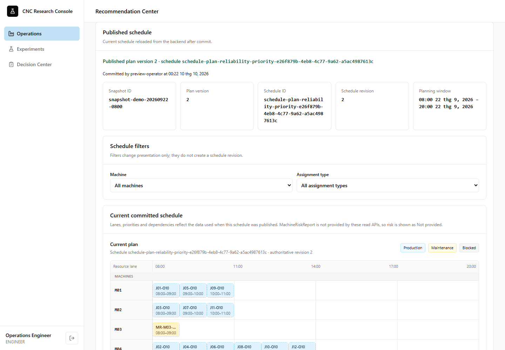
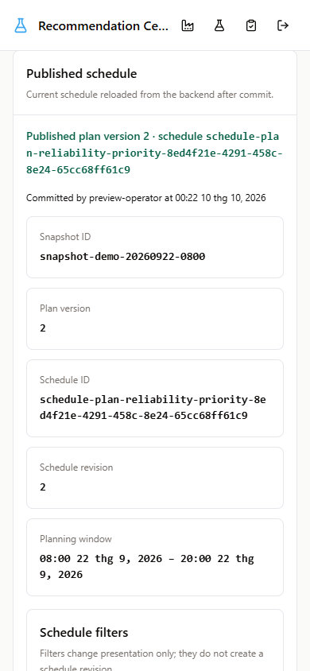
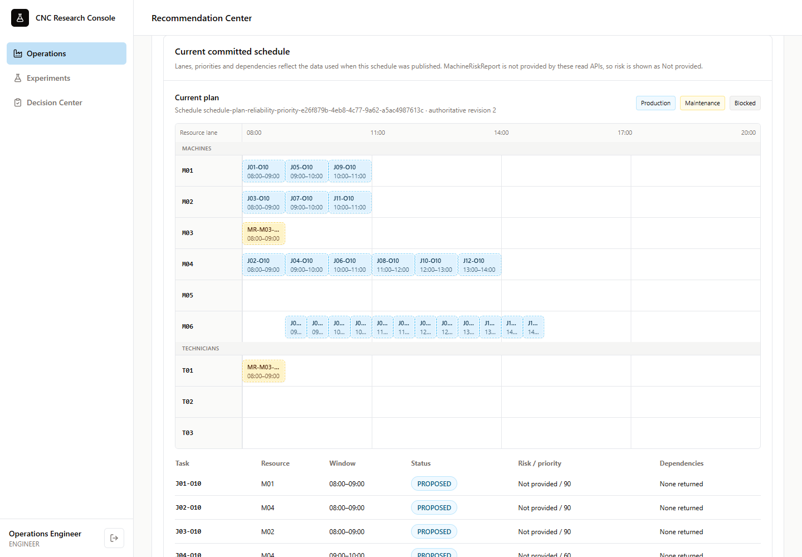
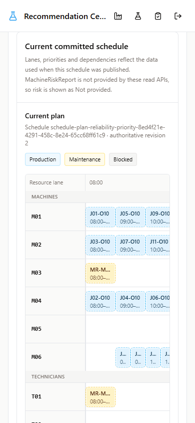
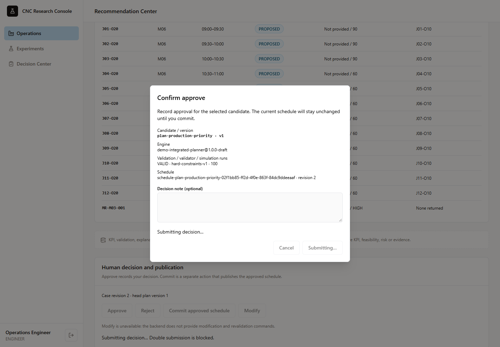
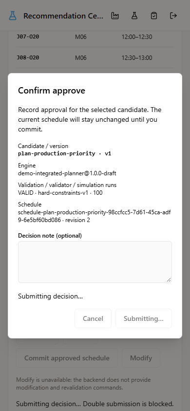
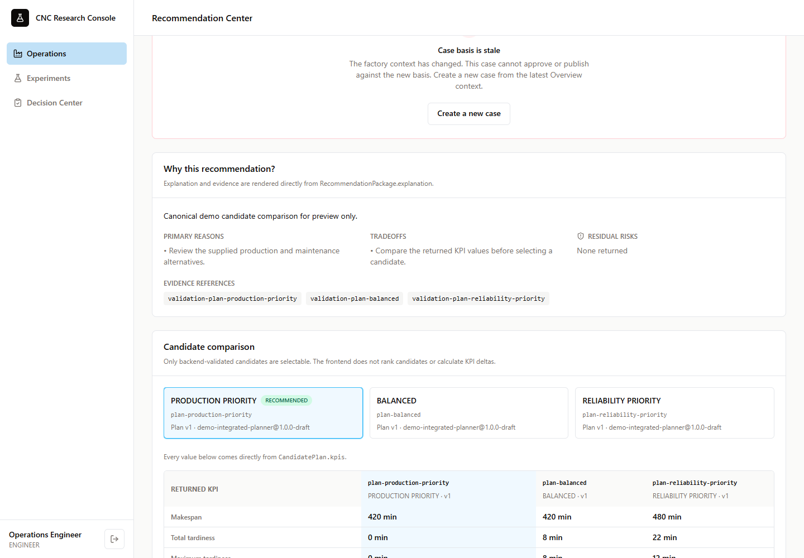
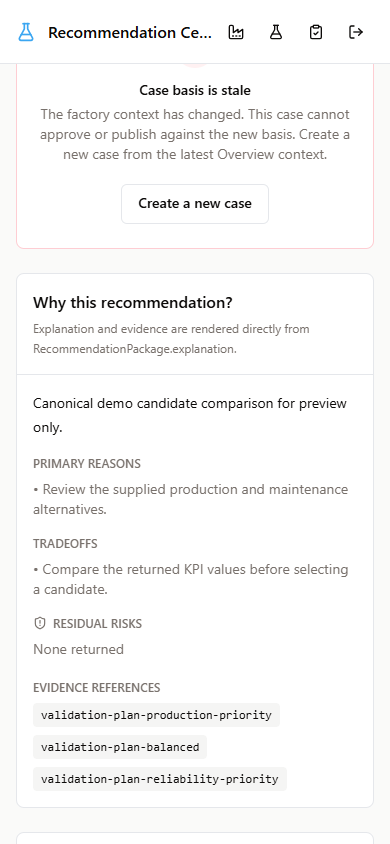
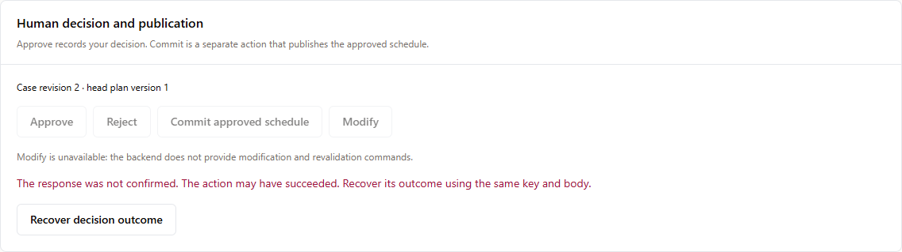
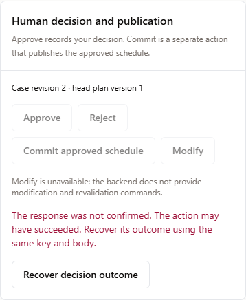

# Live create / approval / commit screenshots

Captured at desktop 1440 × 1000 and mobile 390 × 844 using the Playwright browser
tests. The app runs in real mode through `OperationsApiClient`; the test runner
intercepts backend HTTP/auth responses with the canonical contract harness.
These captures do not claim a running PostgreSQL/worker deployment.

## Success: committed publication and refreshed schedule

## Pending: confirmation blocks double submission

## Stale: create a new case from current context

## Error: unknown outcome preserves the recovery request

