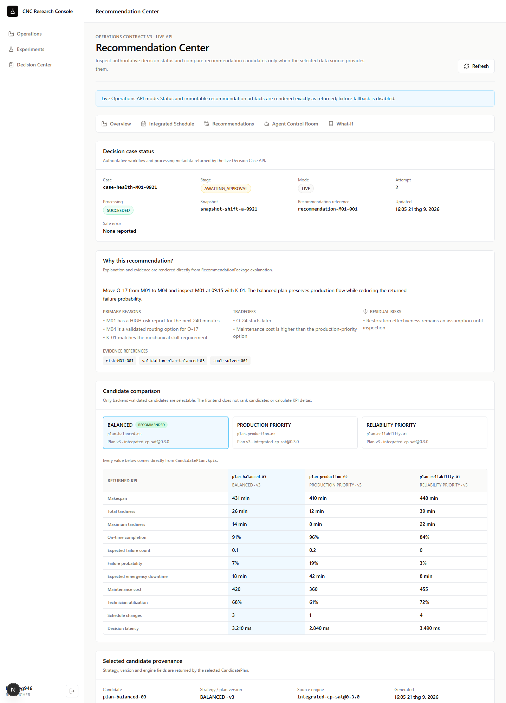
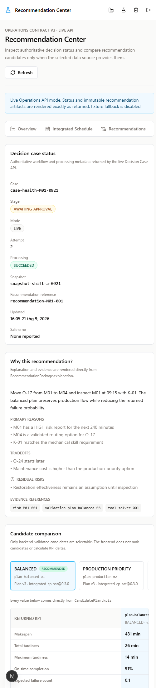
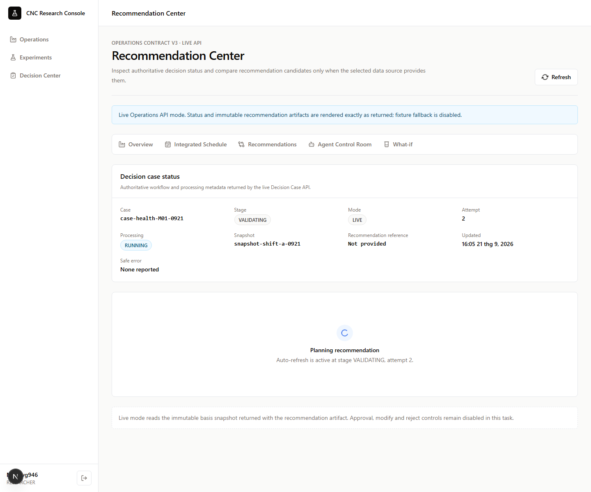
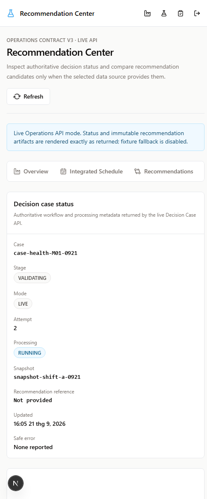
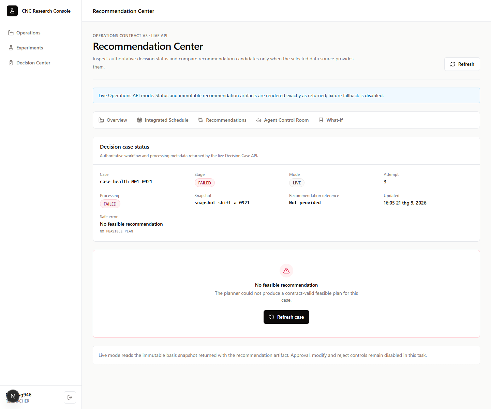
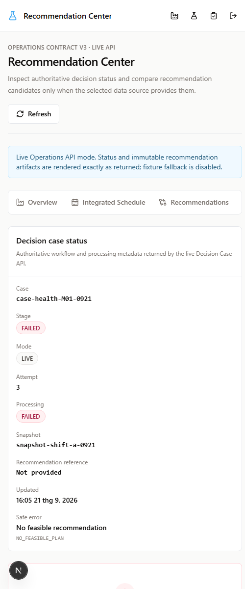

# Live Recommendation Center screenshots

These captures document the real-mode states implemented by the live
Recommendation Center. Desktop captures use a 1440 px viewport; mobile
captures use a 500 px viewport.

The capture harness supplied the same generated `RecommendationPackage` and
immutable basis `FactorySnapshot` objects used by the canonical adapter path.
It has been removed from production code after capture. No approval, modify or
reject controls are enabled in these real-mode examples.

## Package ready

## Planning and polling

## Blocked: no feasible plan

