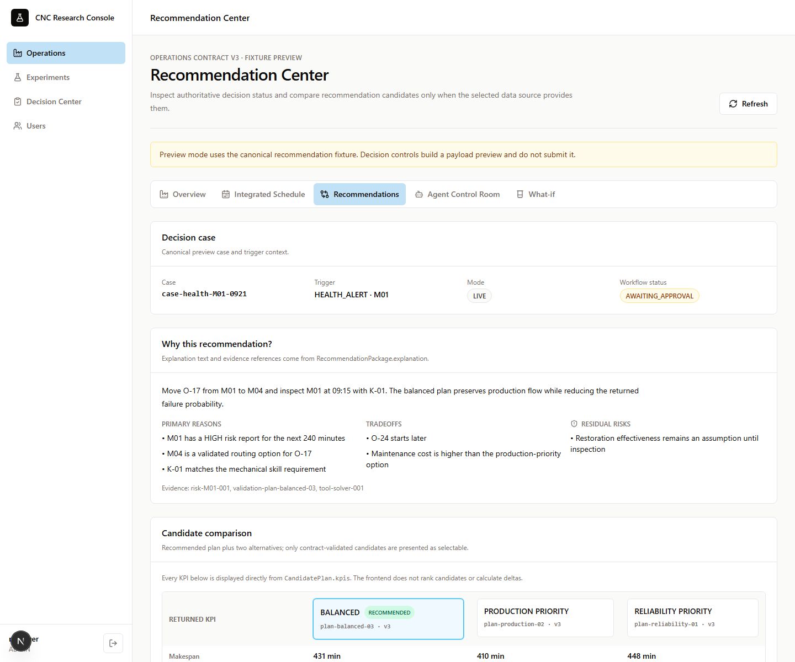
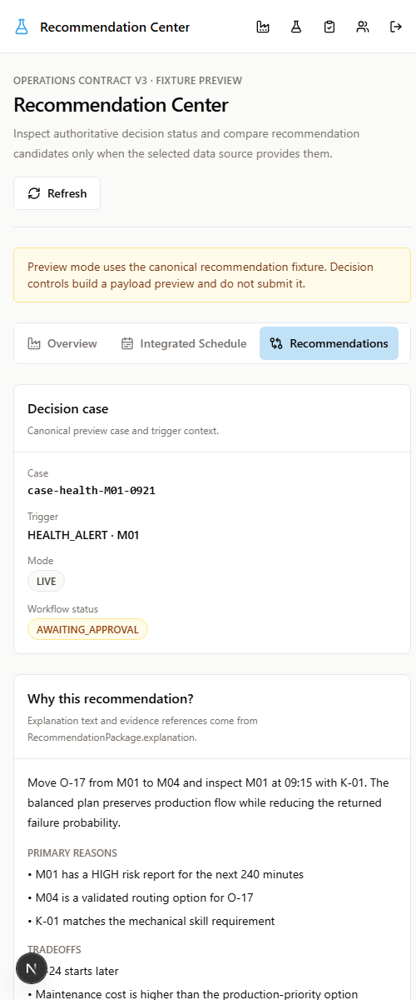
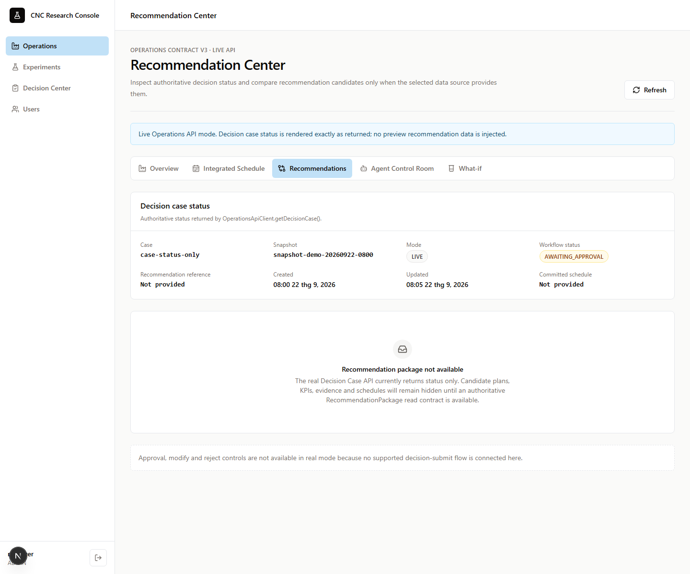
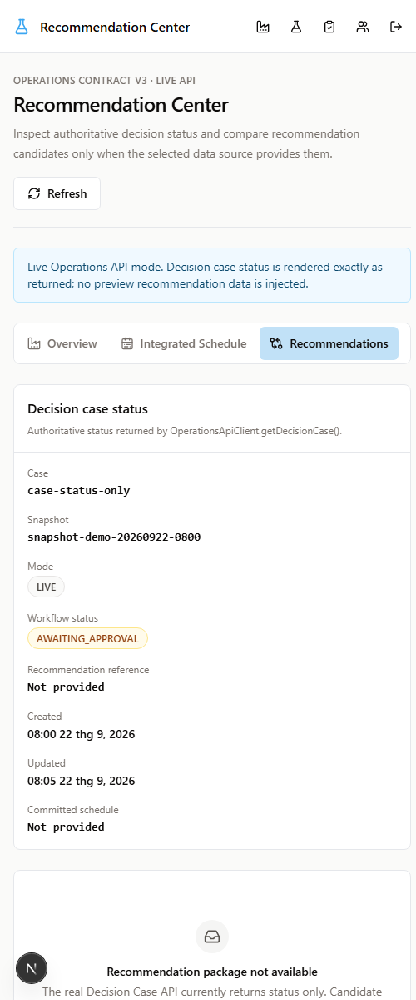
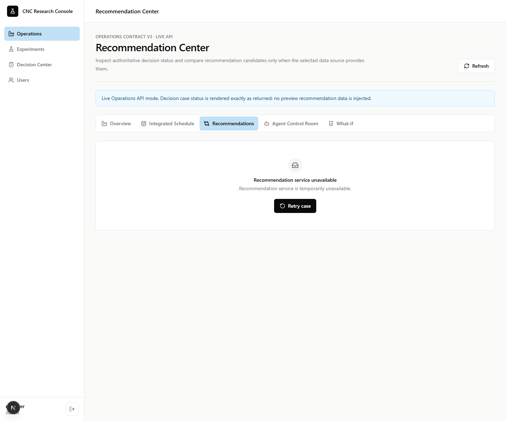
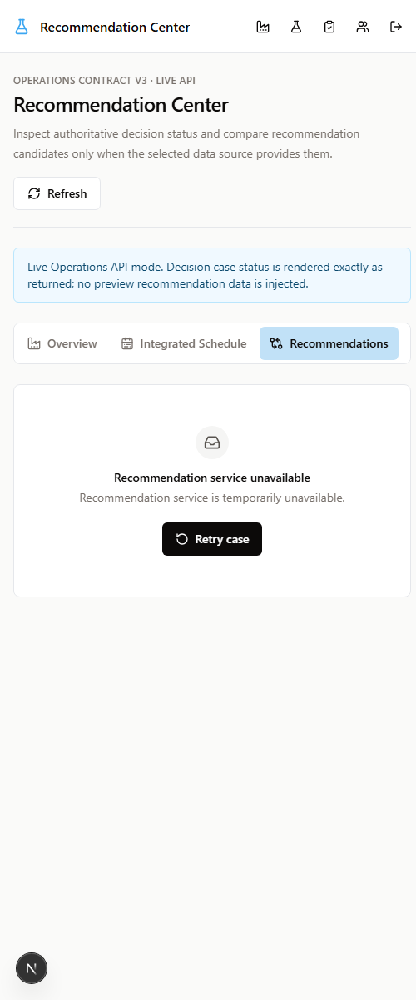

# Recommendation Center screenshots

These screenshots exercise the Recommendation Center data-source boundary at
desktop (1440 × 1200) and mobile layout (500 × 1200). The real-mode captures
use `OperationsApiClient.getDecisionCase()` responses only; they do not inject
the canonical recommendation fixture.

## Mock success

## Real status only

## Real API error

