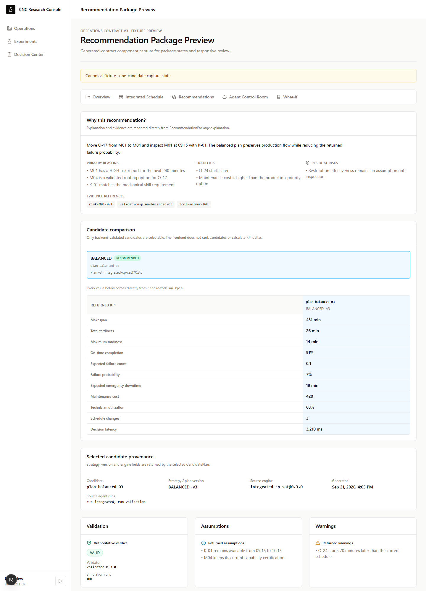
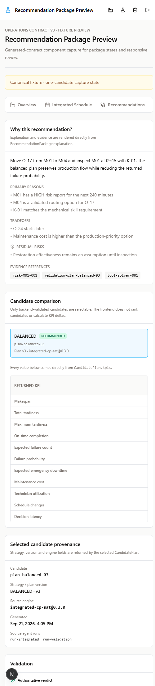
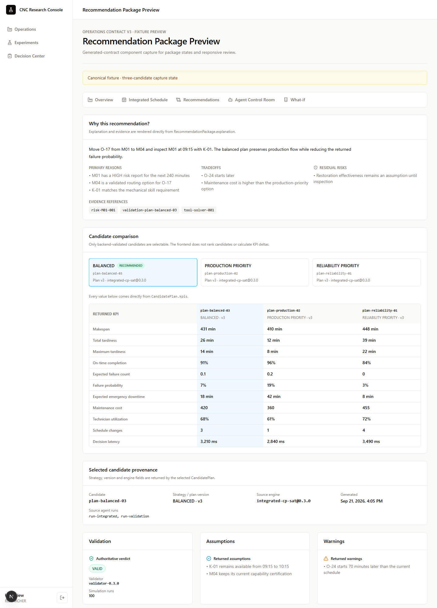
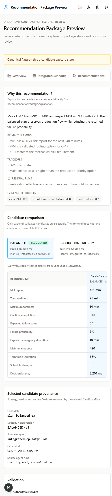
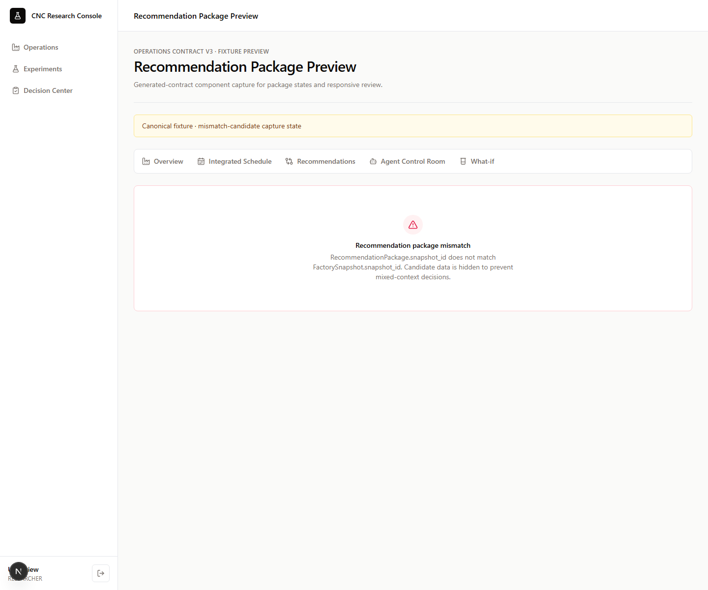
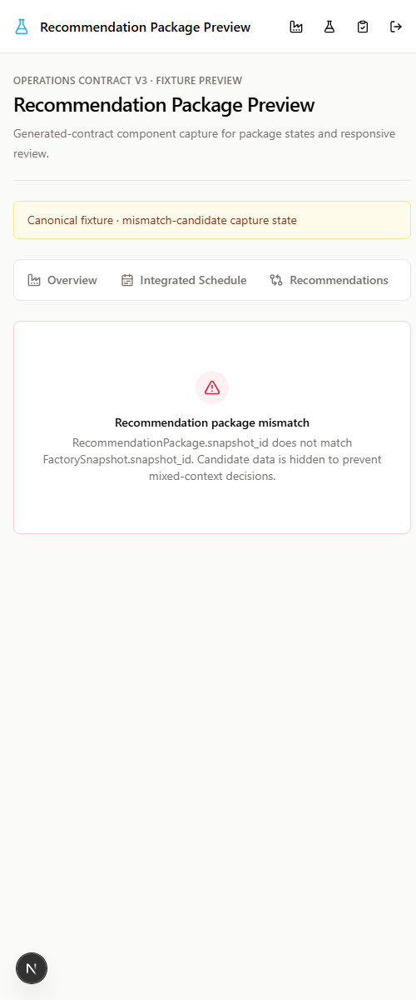

# RecommendationPackageView screenshots

These captures render the pure `RecommendationPackageView` through the generated
operations contract path and canonical mock data source. Desktop captures use a
1440 px viewport; mobile captures use a 500 px viewport. Wide candidate and KPI
content remains inside horizontal scroll regions on mobile.

## One candidate

## Three candidates

## Package and snapshot mismatch

The mismatch captures intentionally change the authoritative snapshot ID. The
component fails closed and hides candidate, KPI, provenance, and schedule data.

